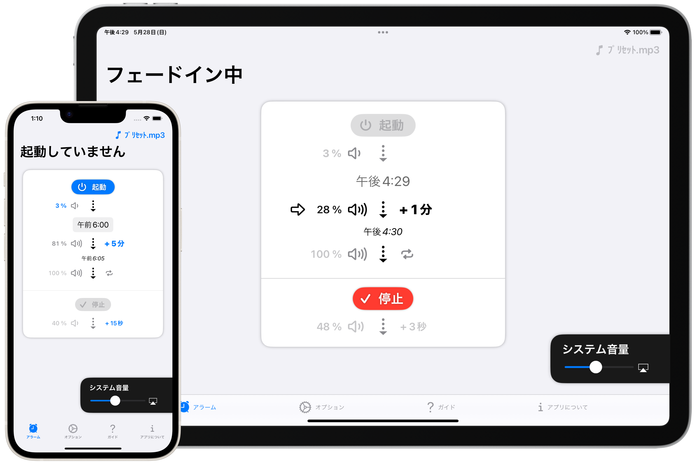
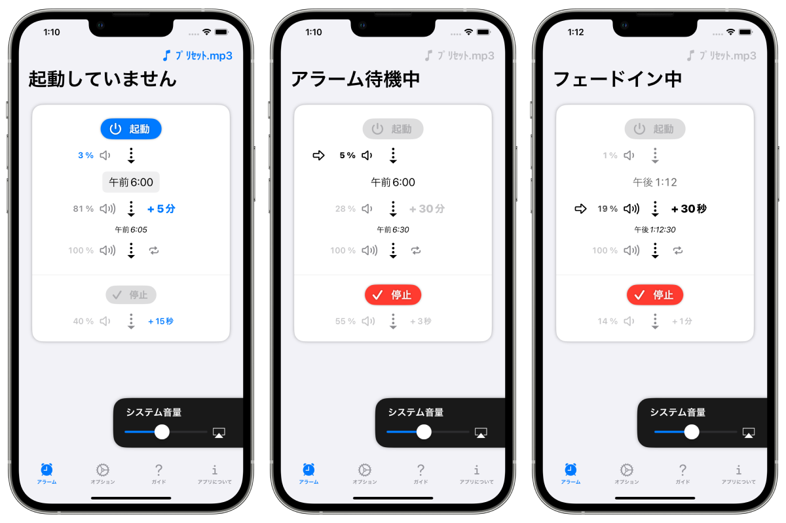

FadeInAlarm フェードインアラーム
===============================
_時間をかけて少しずつ音が大きくなるアラームアプリ_

概要
-----------------------
普通のアラームアプリでは大きな警告音が勢いよく鳴りますが、このアプリではゆったりと少しずつ音量が大きくなることによってあなたに任意の時刻をお知らせします。iPhone、iPad用アプリ。

数十秒から数十分といった長い時間をかけてアラームの音量を少しずつ大きくすることができます。

一般的な目覚ましアラームの音にストレスを感じる方や、とある時刻のその一瞬ではなく大まかな時間間隔で指定した時刻に気付きたい方におすすめです。

### オプション
#### フェードイン時間
- 10秒
- 30秒
- 1分
- 5分
- 30分
- 1時間

#### フェードアウト時間
- 3秒
- 7秒
- 15秒
- 30秒
- 1分

#### 待機中の音量
- 10%
- 5%
- 3%
- 1%
- 0%(無音)

### 動作の流れ
1. 起動ボタンを押すと極小音(もしくは無音)でアラーム音声を再生し始めます。
2. ユーザーが停止ボタンを押すまでアプリはアラーム音声を繰り返し再生し続けます。
3. 設定した時刻になると音量が少しずつ大きくなり、ユーザーが指定した時間間隔(数十秒から数十分)で本来の音量に達します。
4. 停止ボタンを押すとユーザーが指定した時間間隔(数秒から1分)で音量が少しずつ小さくなります。完全に無音になるとアプリはアラーム音声の再生をストップします。

<h3 class="except_printing">デモビデオ</h3>
<video controls width="200" src="preview.mp4">
      Sorry, your browser doesn't support embedded videos.
</video>

* * *

### 注意事項
#### _音源は自分で用意！_
ユーザー自身が用意した音源ファイル(mp3など)をインポートしてください。

動作確認用の音声データはアプリ内にプリセットされています。

#### _普通のアラームアプリより不便な面あり！_
諸事情によりこのアプリは一般的なアラームアプリとは異なり、アプリ自身が全く起動していない状態からアラームを鳴らすことはできません。事前にアプリを起動する必要があります。

例えば、目覚まし目的で朝6時にこのアプリを利用したい場合、就寝する直前にアプリを立ち上げて起動ボタンを押してください。

#### _待機中も制限あり！_
待機中は端末をロックしたり他のアプリを利用したりすることは可能ですが、アラーム待機状態が中断されないように少し注意が必要です。

次のような場面ではアラームの待機状態が中断されます。
- 他のアプリで長時間の動画を見る場面
- 端末の音楽アプリで楽曲を再生する場面

次のような場面ではアラームの待機状態が一時中断されますが、自動的に再開されます。
- カメラアプリを利用している場面
- システムの何らかの通知で音声が発生する場面

* * *

仕様
-------
### 価格
無料

### アプリ内課金
広告を非表示にする(100円)

### プラットフォーム
- iOS 16.0 以降
- iPadOS 16.0 以降

### サポート言語
- 英語
- 日本語

