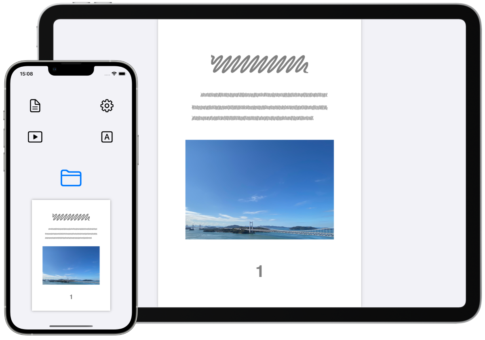
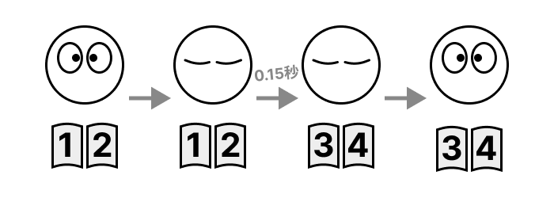

FlipByBlink
==================
_まばたきだけでページめくりができる電子書籍アプリ_

概要
----------
- 特殊な機能は1つだけ。目を閉じる時間を意識的にわずかに長くさせたまばたきでページめくりが出来ます
- シンプルで一般的な電子書籍リーダー(固定レイアウト向け)
- PDFファイルに対応
- カメラであなたのまばたきを認識します

### ユースケース
- 一般的な読書
- 楽譜を見ながら楽器を演奏
- レシピ本を確認しながら料理
- 電車やバスでの読書
- 身体障害を抱える方の読書

* * *

### サポートデバイス
まばたきを検出するためにApple製フレームワークであるARKit/FaceTrackingAPIを使用しています。そのためTrueDepthカメラ、もしくはA12Bionic以降のチップが必要です。

#### ⚠️ サポート対象外のデバイス
- iPhone
  - 6s
  - 6s Plus
  - 7
  - 7 Plus
  - 8
  - 8 Plus
  - SE 第1世代
- iPad
  - 第5世代
  - 第6世代
  - 第7世代
  - Air 第2世代
  - mini 第4世代
  - Pro 9.7インチモデル
  - Pro 10.5インチモデル
  - Pro 12.9インチモデル 第1世代
  - Pro 12.9インチモデル 第2世代
- iPod touch
  - 第7世代

* * *

### 🚧 実験的な機能(オプトイン)
- ページめくりに必要な時間の変更(初期設定では0.15秒)
- 片目ウインクで1ページ戻る機能

* * *

仕様
-------
### 価格
無料

### アプリ内課金
なし

### プラットフォーム
- iOS 14.7 以降
- iPadOS 14.7 以降

### サポート言語
- 日本語
- 英語

### 問い合わせ
sear_pandora_0x@icloud.com

### デベロッパー / パブリッシャー
<table>
<tr>
<th>組織構成</th>
<td>個人系</td>
</tr>
<tr>
<th>人数</th>
<td>1人</td>
</tr>
<tr>
<th>名前</th>
<td>山下亮</td>
</tr>
</table>

### バージョン
3.0.2

