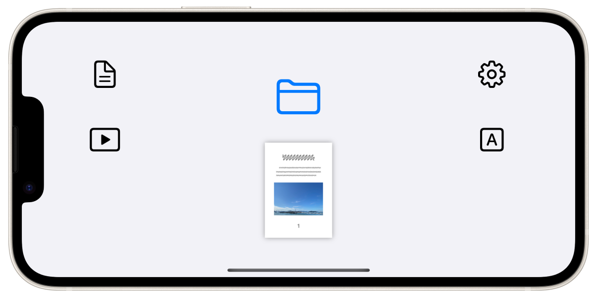

FlipByBlink
==================
まばたきだけでページめくりができる電子書籍アプリ

概要
----------
- シンプルで一般的な電子書籍リーダー(固定レイアウト向け)
- 特殊な機能は1つだけ。目を閉じる時間を意識的にわずかに長くさせたまばたきでページめくりをします
- PDFファイルに対応
- カメラであなたのまばたきを認識

### ユースケース
- 一般的な読書
- 楽譜を見ながら楽器を演奏
- レシピ本を確認しながら料理
- 電車やバスでの読書
- 身体障害を抱える方の読書

### サポートデバイス
瞬目を検出するためにApple製フレームワークであるARKit/FaceTrackingAPIを使用しています。そのためTrueDepthカメラ、もしくはA12Bionic以降のチップが必要です。

#### サポート対象外のデバイス
- iPhone 6s, 6s plus, 7, 7 plus, 8, 8 plus, SE 1st
- iPad 5, 6, 7, Air 2, mini 4, Pro 9.7, Pro 10.5, Pro 12.9 1st, Pro 12.9 2nd
- iPod touch 7

### オプトイン機能
- プレビュー機能のAR映像をカメラ映像に変更
- プレビュー機能の表示が消えないように固定
- 画面収録用にアプリ情報を常時表示
- [実験的な機能] ページめくりに必要な時間の調整機能
- [実験的な機能] 片目ウインクで1ページ戻る

* * *

仕様
-------
### 価格
無料

### アプリ内課金
なし

### プラットフォーム
- iOS 14.7 以降
- iPadOS 14.7 以降

### サポート言語
- 日本語
- 英語

### 問い合わせ
sear_pandora_0x@icloud.com

### デベロッパー / パブリッシャー
<table>
<tr>
<th>組織構成</th>
<td>個人系</td>
</tr>
<tr>
<th>人数</th>
<td>1人</td>
</tr>
<tr>
<th>名前</th>
<td>山下亮</td>
</tr>
</table>

### バージョン
3.0.2
