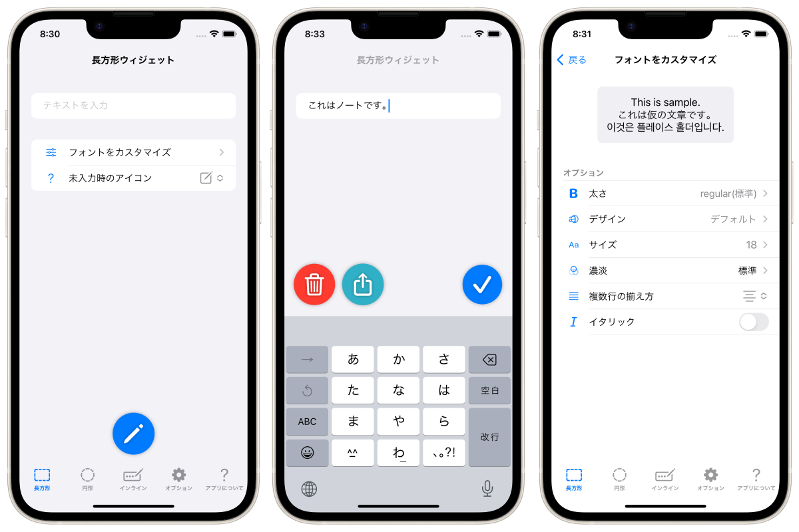
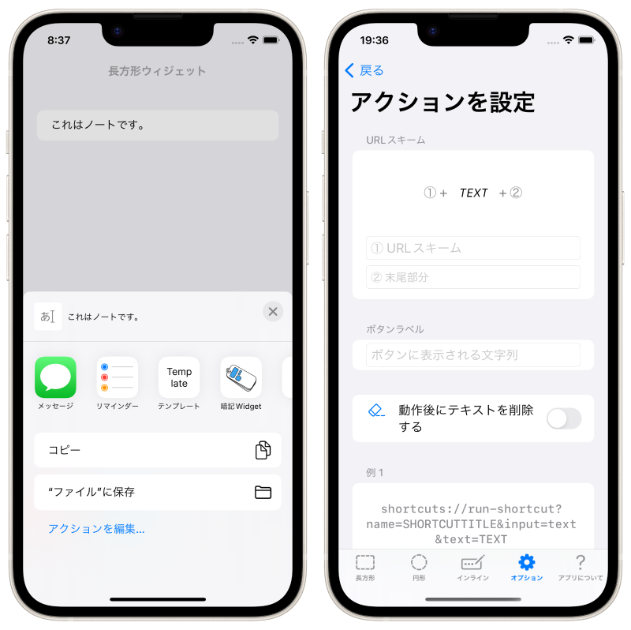

ロックノート LockInNote
=======================
_2022年秋リリースされたiOS16の新機能「ロック画面ウィジェット」に特化したノートアプリ！_

概要
----------
ロック画面ウィジェットに特化したノートアプリです。iPhone専用アプリ。

メモを取リたい時にロック画面上からすぐにメモを書き出して、そのメモはロック画面上でいつでも気軽に確認することができます！

ロック画面上のノートのデザインは柔軟にカスタマイズできるので、「メモを残す」「ロック画面上にテキストを表示する」上での様々な目的を沿った運用が可能です。

ウィジェットをタップすると、すぐにキーボードが立ち上がり、ノートを編集します。

### フォントのサイズやデザイン、太さなどをカスタマイズ

### テキスト未入力時に分かりやすいアイコン

### その他
- テキストをシェアシートで共有
- テキストと連携する任意のURLスキームを呼ぶ

* * *

仕様
-------
### 価格
無料

### アプリ内課金
広告を非表示にする(160円)

### プラットフォーム
- iOS 16.0 以降
- iPadOS 16.0 以降

### サポート言語
- 日本語
- 英語

### 問い合わせ
sear_pandora_0x@icloud.com

### デベロッパー / パブリッシャー
<table>
<tr>
<th>組織構成</th>
<td>個人系</td>
</tr>
<tr>
<th>人数</th>
<td>1人</td>
</tr>
<tr>
<th>名前</th>
<td>山下亮</td>
</tr>
</table>

### バージョン
1.0.2

