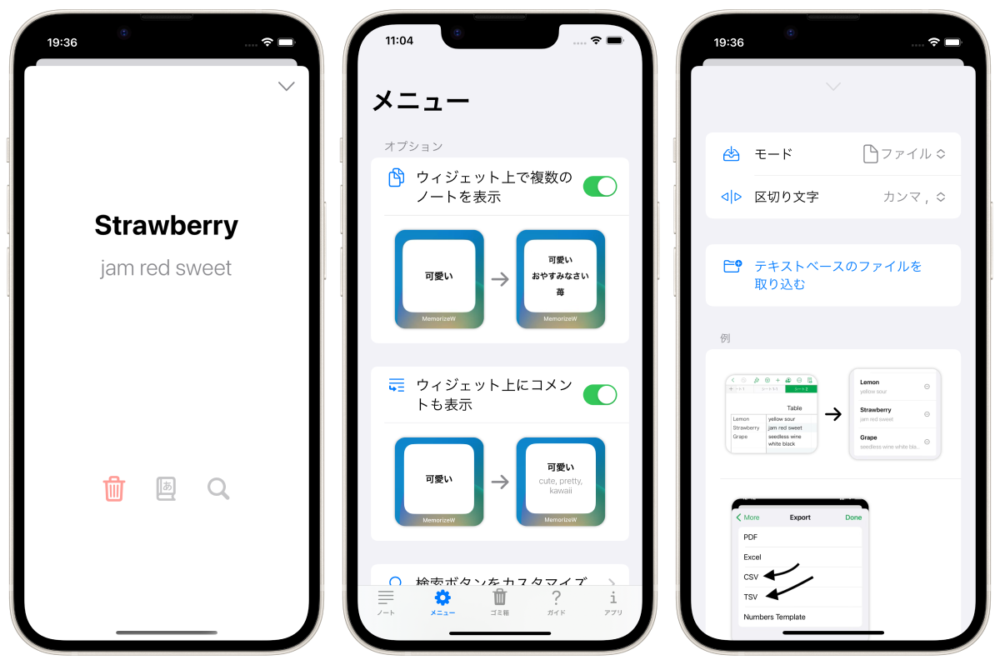

暗記ウィジェット MemorizeWidget
============================
_ウィジェットを暗記帳にしよう_

概要
----------
ウィジェットを暗記帳にしよう。日常の中で知識を脳に染み込ませるアプリです。

- ２つのモード。「単体モード」と「ランダムモード」。
- ランダムモードでは、5分毎に表示されるノートが変わります。
- ロック画面ウィジェットにも対応(iOS16のみ)。
- テキストやファイル(tsvやcsv、txtなど)からインポート可能。
- システム内蔵辞書と連携。
- カスタマイズ可能な検索機能。

### オプション
- ウィジェット上で「タイトル」だけでなく「コメント」を表示することも可能。(ホーム画面のウィジェット/ロック画面の長方形ウィジェット)

* * *

仕様
-------
### 価格
無料

### アプリ内課金
広告を非表示にする(160円)

### プラットフォーム
- iOS 15.6 以降
- iPadOS 15.6 以降

### サポート言語
- 日本語
- 英語

### 問い合わせ
sear_pandora_0x@icloud.com

### デベロッパー / パブリッシャー
<table>
<tr>
<th>組織構成</th>
<td>個人系</td>
</tr>
<tr>
<th>人数</th>
<td>1人</td>
</tr>
<tr>
<th>名前</th>
<td>山下亮</td>
</tr>
</table>

### バージョン
1.1

