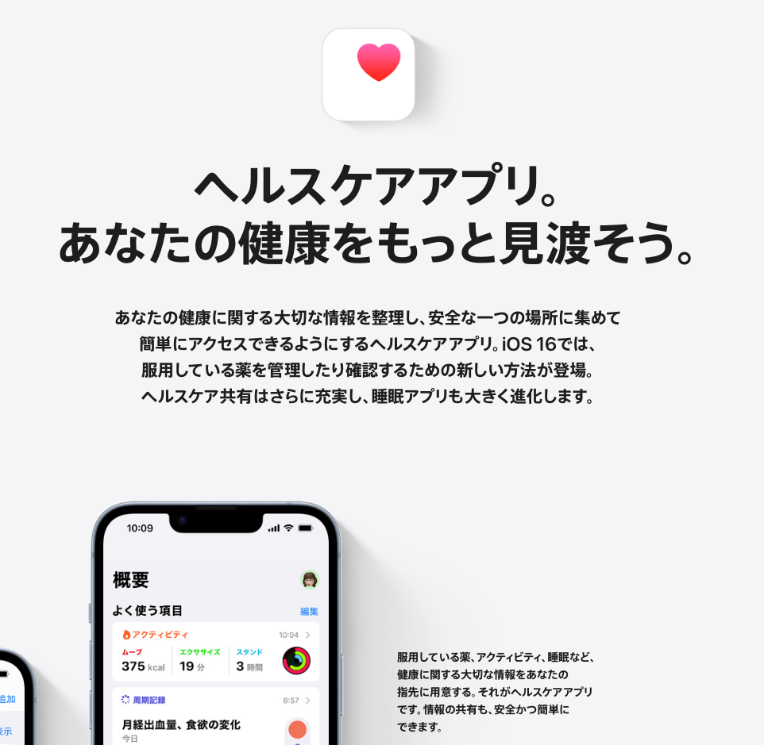
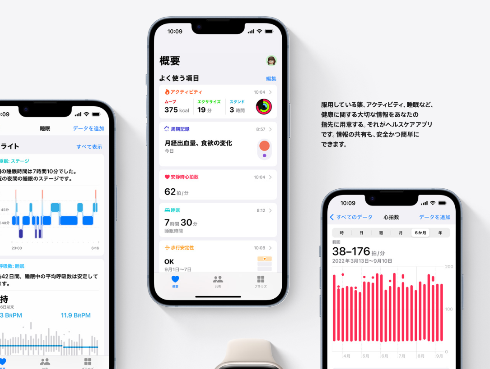
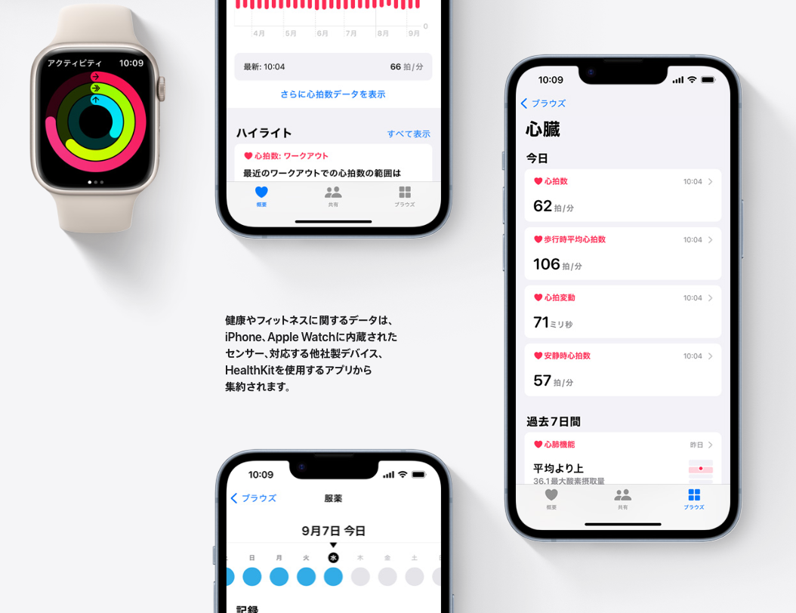

補足資料: 「ヘルスケア」アプリとは
========================
> ヘルスケアアプリ。
あなたの健康をもっと見渡そう。
あなたの健康に関する大切な情報を整理し、安全な一つの場所に集めて
簡単にアクセスできるようにするヘルスケアアプリ。

> 服用している薬、アクティビティ、睡眠など、健康に関する大切な情報をあなたの指先に用意する。それがヘルスケアアプリです。

> 健康やフィットネスに関するデータは、iPhone、Apple Watchに内蔵されたセンサー、対応する他社製デバイス、HealthKitを使用するアプリから集約されます。

