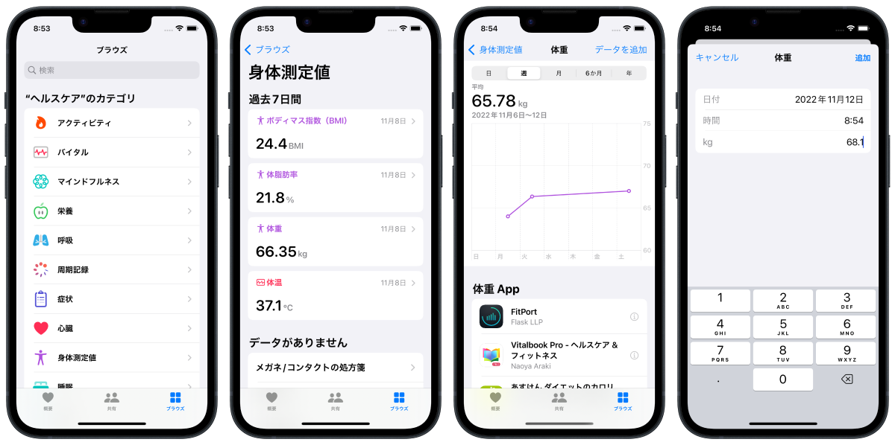

補足資料「ヘルスケアアプリとは」
================================
個人の総合的な健康情報を記録するためのApple製アプリ。iPhoneにプリインストールされている。

> __ヘルスケアアプリ。あなたの健康をもっと見渡そう。__
>
> あなたの健康に関する大切な情報を整理し、安全な一つの場所に集めて
簡単にアクセスできるようにするヘルスケアアプリ。

> 服用している薬、アクティビティ、睡眠など、健康に関する大切な情報をあなたの指先に用意する。それがヘルスケアアプリです。

> 健康やフィットネスに関するデータは、iPhone、Apple Watchに内蔵されたセンサー、対応する他社製デバイス、HealthKitを使用するアプリから集約されます。

* * *

ヘルスケアアプリに任意のデータを手入力する場合
---------------------------------------
1. ヘルスケアアプリを開く
2. カテゴリ一覧から入力したい項目(例えば体温や体重)を選択
3. カテゴリ詳細画面の右上にある「データを追加」ボタンを押す
4. 汎用ソフトウェアキーボードで数値を入力
5. 右上の「追加」ボタンを押して完了

