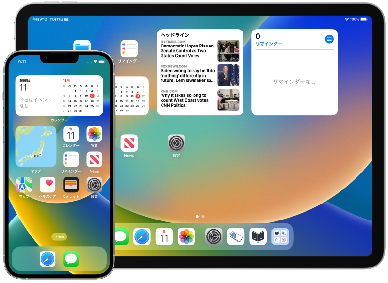
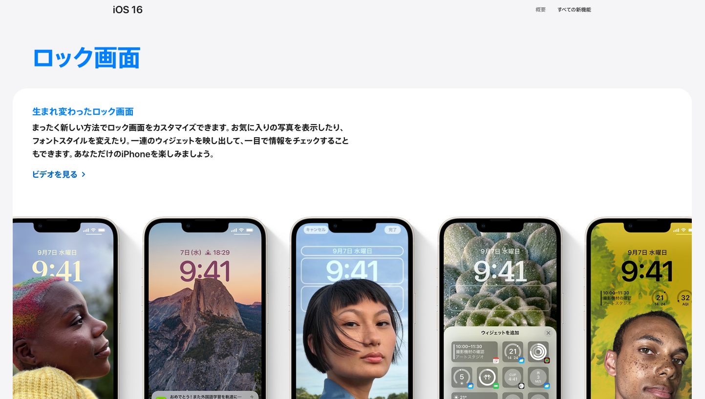
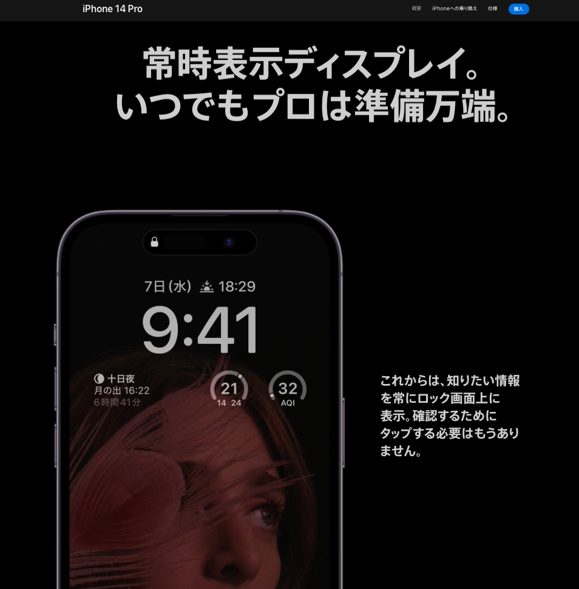

補足資料「ウィジェットとは」
========================
> ウィジェットには、よく使うAppからの一目で分かる情報（その日の主要なニュース、天気、カレンダーのイベント、バッテリー残量など）が表示されます。 「今日の表示」にウィジェットを表示できます。 ホーム画面やロック画面にウィジェットを追加して、これらの情報をいつでもすぐに利用できるようにすることもできます。

2022秋に登場したロック画面ウィジェット
---------------------------------
2022秋にリリースされたiOSのメジャーアップデート「iOS16」では、目玉新機能としてロック画面のカスタマイズ機能が搭載されました。その中の1つとしてロック画面ウィジェットが登場しました。

> __生まれ変わったロック画面__
>
> まったく新しい方法でロック画面をカスタマイズできます。お気に入りの写真を表示したり、フォントスタイルを変えたり。一連のウィジェットを映し出して、一目で情報をチェックすることもできます。あなただけのiPhoneを楽しみましょう。
>
> ロック画面上のウィジェットなら、天気、カレンダーのイベント、日付、時間帯、アラーム、バッテリー残量、アクティビティリングの進捗など、あなたがよく使うアプリのデータを一目ですばやくチェックできます。

### 最新機種 iPhone 14 Pro の常時表示ディスプレイ
2022秋に発売された最新機種 iPhone 14 Pro では新機能として常時表示ディスプレイが搭載されました。iPhoneをロックすると画面が真っ暗になるのではなくロック画面が常に表示されるようになりました。この際、ロック画面ウィジェットも常に表示されます。

> __常時表示ディスプレイ。いつでもプロは準備万端。__
>
> これからは、知りたい情報を常にロック画面上に表示。確認するためにタップする必要はもうありません。

