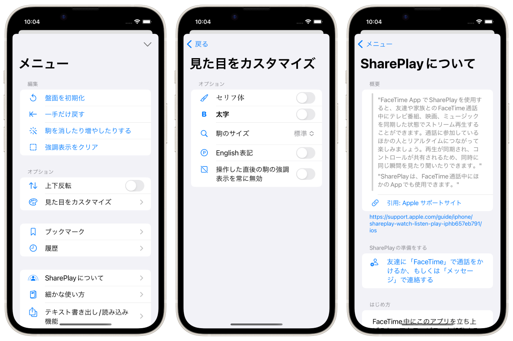

Plain将棋盤
==============
_最もプレーンな将棋盤アプリ_


[](https://apps.apple.com/app/id1620268476)


概要
----------
駒を自由に動かせるただの将棋盤です。

iOSの標準デザインに沿ったシンプルな将棋盤アプリです。

文字のサイズや太さなどはOSシステム設定に適応して変わります。

任意の駒を消したり増やしたりことも出来ます。

駒を英語表記に変えられます。


### テキスト書き出し/読み込み
盤面をテキストデータとして書き出したり読み込んだり出来ます。

```
☗
－－－－－－－－－
香͙桂͙銀͙金͙王͙金͙銀͙桂͙香͙
　飛͙　　　　　角͙　
歩͙歩͙歩͙歩͙歩͙歩͙歩͙歩͙歩͙
　　　　　　　　　
　　　　　　　　　
　　　　　　　　　
歩歩歩歩歩歩歩歩歩
　　　　　　　　　
　　銀金王金銀　　
－－－－－－－－－
☖角飛香2桂2
```



* * *

仕様
-------
### 価格
無料

### アプリ内課金
広告を非表示にする(320円)

### プラットフォーム
- iOS 15.4 以降
- iPadOS 15.4 以降

### サポート言語
- 日本語
- 英語

### 問い合わせ
sear_pandora_0x@icloud.com

### デベロッパー / パブリッシャー
<table>
<tr>
<th>組織構成</th>
<td>個人系</td>
</tr>
<tr>
<th>人数</th>
<td>1人</td>
</tr>
<tr>
<th>名前</th>
<td>山下亮</td>
</tr>
</table>

### バージョン
1.2.2


