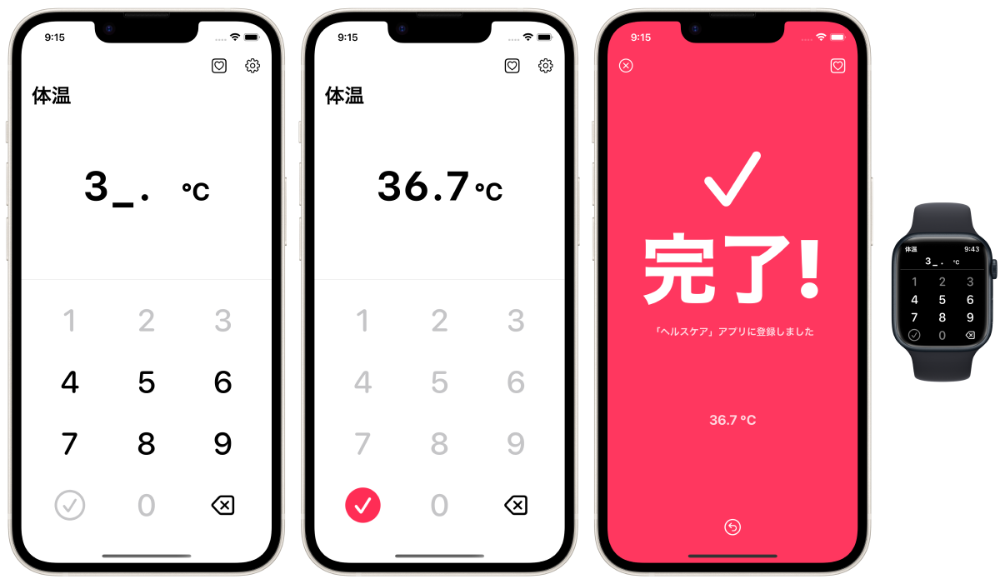

TapTemperature 体温登録
=============================
_Apple「ヘルスケア」アプリに体温を最速で登録しよう_

概要
-----------------
iPhoneにプリインストールされているApple「ヘルスケア」アプリに体温データを(手動としては)最速で登録するためのアプリです。iPhone/Apple Watch専用アプリ。

### 想定ユーザー / ユースケース
- スマート体温計を持っていない。
- 日常的に体温(か基礎体温)を体温計で計測している。
- 普通の体温計で測定した直後、毎回手動で測定結果を「ヘルスケア」アプリに登録する事を検討している。

### オプション
- 基礎体温モード
- 小数点以下2桁モード
- 数字入力だけで自動的に完了する機能

### その他
- Apple Watchでも利用できます
- このアプリ内からApple「ヘルスケア」アプリをワンタップで立ち上げ可能
- データ登録直後にワンタップで登録取り消しする機能
- 単位
  - ℃ 摂氏
  - ℉ 華氏

### 注意
このアプリでは「ヘルスケア」アプリ上の過去のデータの読み込みや閲覧、管理等は出来ません。このアプリは「ヘルスケア」アプリへのデータ登録のみを目的としています。登録したデータは「ヘルスケア」アプリ上で確認してください。

### 背景
人々は体温計を用いて体温(や基礎体温)は日々頻繁に計測します。多くのiPhoneユーザーは「ヘルスケア」アプリ上に体温(や基礎体温)のデータを登録しています。

「ヘルスケア」アプリと連携して自動的に計測データを保存してくれるスマート体温計を用いることが最高の解決策ではありますが、それらは高価であったり入手性が低かったりします。「ヘルスケア」アプリ上で手動でもデータ登録は可能ですが、残念ながら「ヘルスケア」アプリは計測データを日常的に手動で登録することを想定されていません。そのため、体温測定のような日々継続的に発生するデータを手動で入力することは大いに手間が掛かりストレスフルな体験になります。

そうした課題を解決するためにこのアプリは開発しました。

* * *

仕様
-------
### 価格
無料

### アプリ内課金
広告を非表示にする(160円)

### プラットフォーム
- iOS 15.0 以降

### サポート言語
- 全て
  - 日本語
  - 英語
- 主要4単語(体重/BMI/体脂肪率/ヘルスケア)のみ翻訳
  - 中国語 簡体字
  - 中国語 繁体字
  - スペイン語
  - ポルトガル語
  - ロシア語
  - インドネシア語
  - フランス語
  - アラビア語
  - ドイツ語
  - 韓国語
  - ウクライナ語

