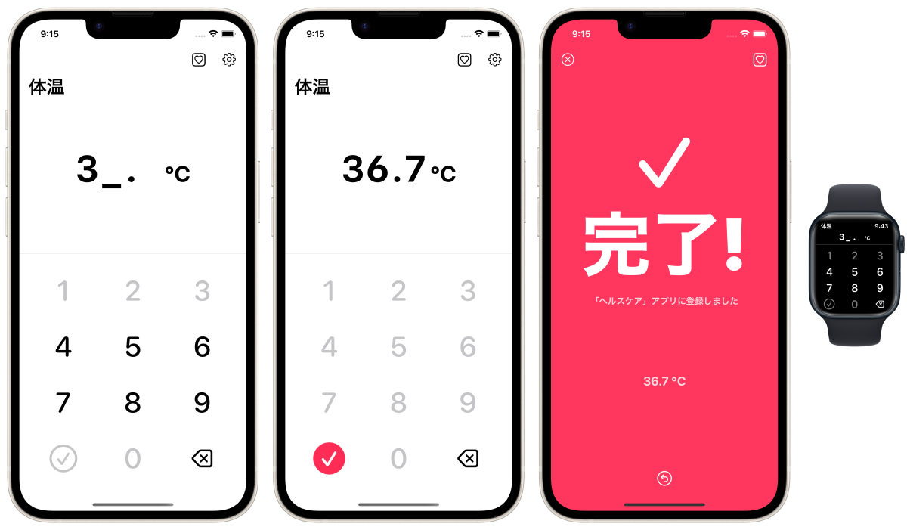

アプリ紹介ページ
===============

Plain将棋盤
---------------

最もプレーンな将棋盤アプリ

[製品情報を読む](Plain将棋盤)

* * *

FadeInAlarm
--------------

時間をかけて少しずつ音が大きくなる極めて珍しいアラームアプリ

[製品情報を読む](FadeInAlarm)

* * *

FlipByBlink
---------------

まばたきだけでページめくりができる電子書籍アプリ

[製品情報を読む](FlipByBlink)

* * *

体重登録
---------

iPhoneにプリインストールされている「ヘルスケア」アプリに体重データを(手動としては)最速で登録するためのアプリ

[製品情報を読む](TapWeight)

### 補足資料
[ヘルスケアアプリとは](Others/about_healthcare)

* * *

体温登録
---------

iPhoneにプリインストールされている「ヘルスケア」アプリに体温データを(手動としては)最速で登録するためのアプリ

[製品情報を読む](TapTemperature)

### 補足資料
[ヘルスケアアプリとは](Others/about_healthcare)

* * *

暗記ウィジェット
--------------

ホーム画面やロック画面を暗記帳にするアプリ

[製品情報を読む](MemorizeWidget)

### 補足資料
[ウィジェットとは](Others/about_widget)

* * *

ロックノート
---------------

2022年秋リリースされたiOS16の新機能「ロック画面ウィジェット」に特化したノートアプリ

[製品情報を読む](LockInNote)

### 補足資料
[ウィジェットとは](Others/about_widget)
