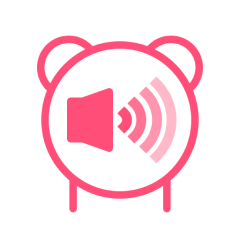

Ryo Yamashita のアプリ
======================

FlipByBlink
---------------

まばたきだけでページめくりができる電子書籍アプリ

[製品情報を読む](FlipByBlink)

* * *

Plain将棋盤
---------------

最もプレーンな将棋盤アプリ

[製品情報を読む](Plain将棋盤)

* * *

FadeInAlarm
--------------

時間をかけて少しずつ音が大きくなる唯一のアラームアプリ

[製品情報を読む](FadeInAlarm)

* * *

体重登録
---------

iPhoneにプリインストールされているApple「ヘルスケア」アプリに体重データを(手動としては)最速で登録するためのアプリ

[製品情報を読む](TapWeight)

* * *

体温登録
---------

iPhoneにプリインストールされているApple「ヘルスケア」アプリに体温データを(手動としては)最速で登録するためのアプリ

[製品情報を読む](TapTemperature)

* * *

ロックノート
---------------

iOS16で登場したロック画面ウィジェット専用のノートアプリ

[製品情報を読む](LockInNote)

* * *

暗記ウィジェット
--------------

ホーム画面やロック画面に配置したウィジェットを暗記帳にできるアプリ

[製品情報を読む](MemorizeWidget)
