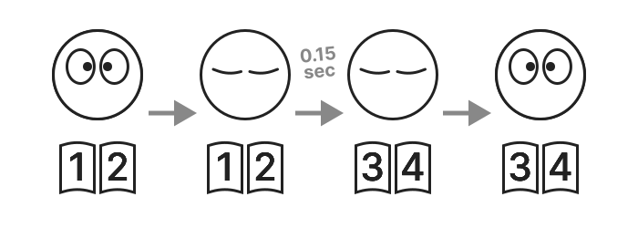
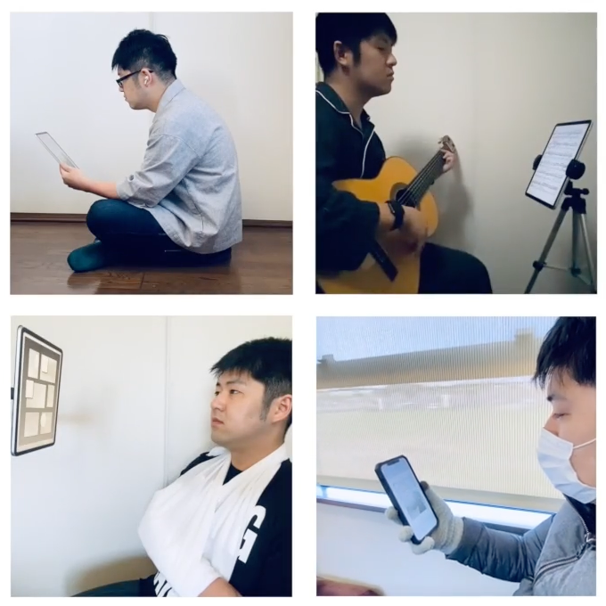

<h1 translate="no">FlipByBlink</h1>

_まばたきだけでページめくりができる電子書籍アプリ_

概要
----------
特殊な機能が1つだけ。目を閉じる時間を意識的にわずかに長くさせたまばたきでページめくりが出来ます。iPhone、iPad用アプリ。

上記の機能以外はシンプルで一般的な電子書籍リーダーアプリです。

### ページめくりの仕組み

閉瞼を少し長めに行うとページ送りを行われ、目を開けたタイミングでは既に次のページに遷移した状態になります。普通のまばたきではページめくりされません。

デバイス内蔵のカメラやセンサーでまばたきを検知します。

一般的な電子書籍アプリ同様に、画面タップや画面スワイプでもページめくりできます。

### 電子書籍フォーマット
- 「固定レイアウト」書籍のみを対象。例えば紙本をそのまま転用したものや漫画など
- PDFファイルやZIPファイルのインポートに対応

### ユースケース
- 一般的な読書
- 楽譜を見ながら楽器を演奏
- レシピ本を確認しながら料理
- 電車やバスでの読書
- 身体障害を抱える方の読書

* * *

### サポートデバイス
まばたきを検出するためにApple製フレームワークであるARKit/FaceTrackingAPIを使用しています。そのためTrueDepthカメラ、もしくはA12Bionic以降のチップが必要です。

#### ⚠️ サポート対象外のデバイス
- iPhone
  - 6s
  - 6s Plus
  - 7
  - 7 Plus
  - 8
  - 8 Plus
  - SE 第1世代
- iPad
  - 第5世代
  - 第6世代
  - 第7世代
  - Air 第2世代
  - mini 第4世代
  - Pro 9.7インチモデル
  - Pro 10.5インチモデル
  - Pro 12.9インチモデル 第1世代
  - Pro 12.9インチモデル 第2世代
- iPod touch
  - 第7世代

* * *

### 🚧 実験的な機能(オプトイン)
- ページめくりに必要な時間の変更(初期設定では0.15秒)
- 片目ウインクで1ページ戻る機能

* * *

仕様
-------
### 価格
無料

### アプリ内課金
なし

### プラットフォーム
- iOS 15.0 以降
- iPadOS 15.0 以降

