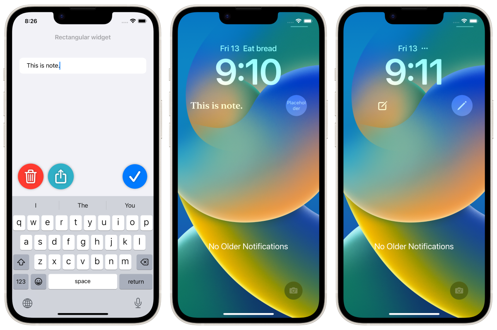
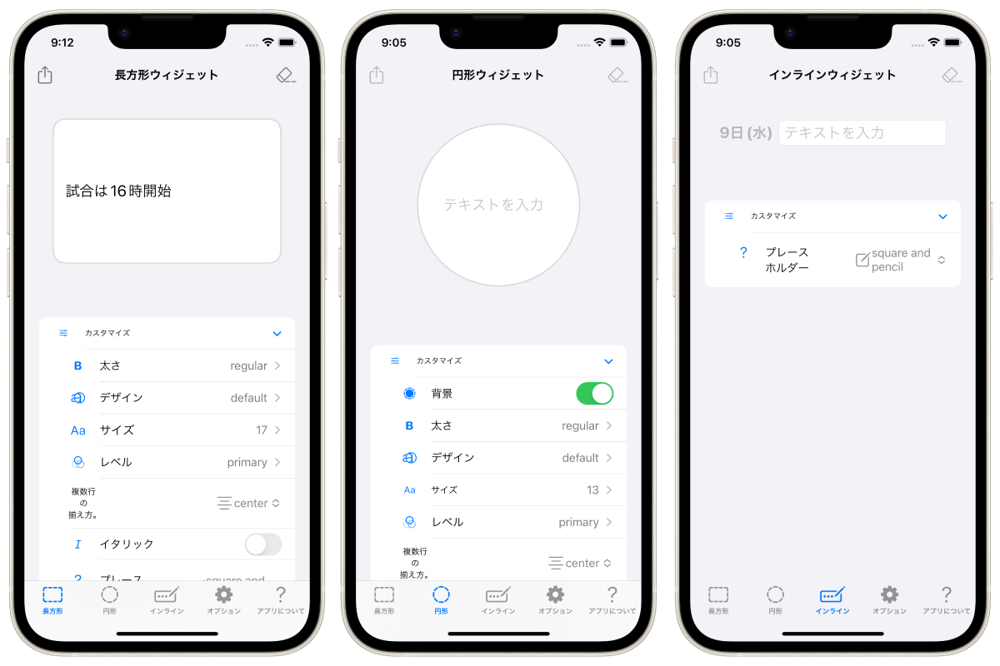
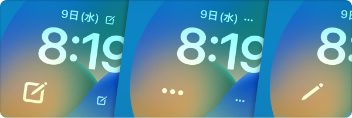
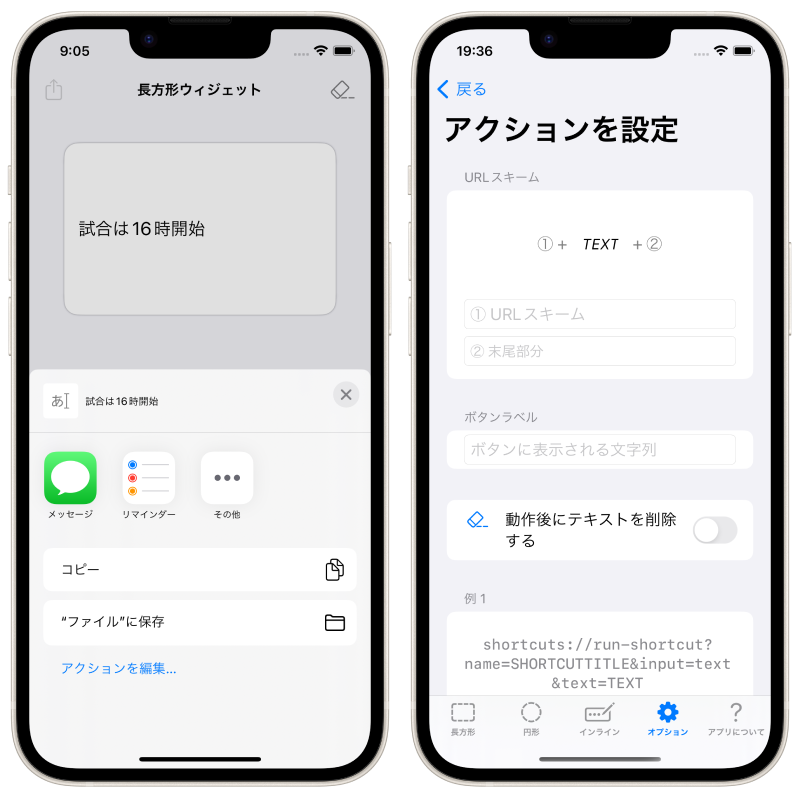
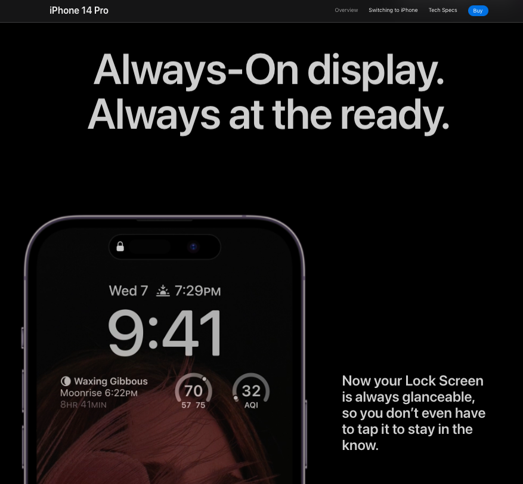

<h1 translate="no">LockInNote</h1>

_2022年秋リリースされたiOS16の新機能「ロック画面ウィジェット」に特化したノートアプリ！_

概要
----------
ロック画面ウィジェットに特化したノートアプリです。iPhone/Apple Watch向けアプリ。

メモを取リたい時にロック画面上からすぐにメモを書き出して、そのメモはロック画面上でいつでも気軽に確認することができます！

Apple Watch と連携できます。

ロック画面上のノートのデザインは柔軟にカスタマイズできるので、「メモを残す」「ロック画面上にテキストを表示する」上での様々な目的を沿った運用が可能です。

ウィジェットをタップすると、すぐにキーボードが立ち上がり、ノートを編集します。

### フォントのサイズやデザイン、太さなどをカスタマイズ

### テキスト未入力時に分かりやすいアイコン

### その他
- テキストをシェアシートで共有
- テキストと連携する任意のURLスキームを呼ぶ

### 最新機種 iPhone 14 Pro にオススメ！
常時表示ディスプレイが搭載された iPhone 14 Pro だと、iPhoneが最も身近なメモ帳に変身。

> 
>
> _引用: https://www.apple.com/jp/iphone-14-pro/_

* * *

仕様
-------
### 価格
無料

### アプリ内課金
広告を非表示にする(160円)

### プラットフォーム
- iOS 16.0 以降
- iPadOS 16.0 以降

### サポート言語
- 日本語
- 英語

