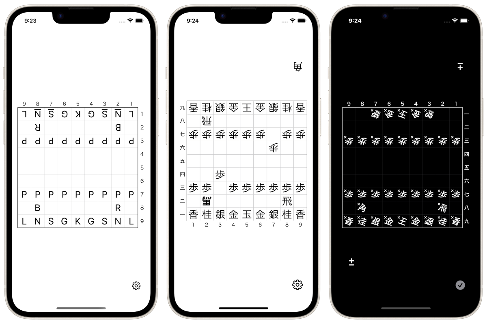

<h1 translate="no">Plain将棋盤 / Plain Shogi Board</h1>

_最もプレーンな将棋盤アプリ_


<a href="https://apps.apple.com/app/id1620268476" target="blank">
  
</a>


概要
----------
駒を自由に動かせるただの将棋盤です。iPhone、iPad、Mac、Apple Watch、Apple TV向けアプリ。

iOSの標準デザインに沿ったシンプルな将棋盤アプリです。

任意の駒を消したり増やしたりことも出来ます。

文字の「大きさ」や「太さ」、「セリフ体」などをカスタマイズ出来ます。

駒を英語表記に変えられます。

盤面をテキストデータとして書き出したり読み込んだり出来ます。

局面はiCloudによって端末間で同期されます。



### SharePlay
SharePlayに対応しています。

FaceTimeしながら友達と将棋盤を囲むことが出来ます。

SharePlay機能では「2人でシンプルに対局する」だけでなく、「大人数で詰将棋を解く」などの様々なユースケースを想定しています。


### テキスト書き出し/読み込み
盤面をテキストデータとして書き出したり読み込んだり出来ます。

<div translate="no">

```
☗角͙
－－－－－－－－－
香͙桂͙銀͙金͙王͙金͙銀͙桂͙香͙
　飛͙　　　　　　　
歩͙歩͙歩͙歩͙歩͙歩͙　歩͙歩͙
　　　　　　歩͙　　
　　　　　　　　　
　　歩　　　　　　
歩歩　歩歩歩歩歩歩
　馬͙　　　　　飛　
香桂銀金王金銀桂香
－－－－－－－－－
☖
```
</div>


* * *

仕様
-------
### 価格
無料

### アプリ内課金
広告を非表示にする(320円)

### プラットフォーム
- iOS 15.4 以降
- iPadOS 15.4 以降

### サポート言語
- 日本語
- 英語

<a href="https://apps.apple.com/app/id1620268476" target="blank">
  
</a>
